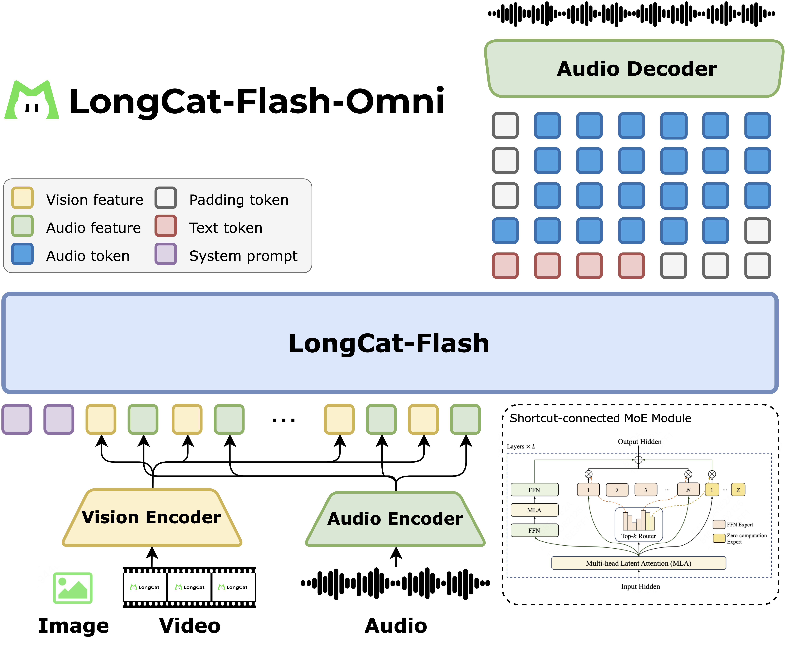

# LongCat-Flash-Omni

<div align="center">
  
</div>
<hr>

<div align="center" style="line-height: 1;">
  <a href="https://longcat.ai/" target="_blank" style="margin: 2px;">
    
  </a>
  <a href="https://huggingface.co/meituan-longcat" target="_blank" style="margin: 2px;">
    
  </a>
</div>

<div align="center" style="line-height: 1;">
  <a href="https://github.com/meituan-longcat/LongCat-Flash-Omni/blob/main/figures/wechat_official_accounts.jpg" target="_blank" style="margin: 2px;">
    
  </a>
  <a href="https://x.com/Meituan_LongCat" target="_blank" style="margin: 2px;">
    
  </a>
</div>

<div align="center" style="line-height: 1;">
  <a href="LICENSE" style="margin: 2px;">
    
  </a>
</div>

<p align="center">
  <a href="https://github.com/meituan-longcat/LongCat-Flash-Omni/blob/main/tech_report.pdf"><b>Tech Report</b>&nbsp;📄</a>
</p>

## Model Introduction
We introduce **LongCat-Flash-Omni**, a state-of-the-art open-source omni-modal model with 560 billion parameters (with 27B activated), excelling at real-time audio-visual interaction, which is attained by leveraging [LongCat-Flash](https://github.com/meituan-longcat/LongCat-Flash-Chat)'s high-performance Shortcut-connected Mixture-of-Experts (MoE) architecture with zero-computation experts, augmented by efficient multimodal perception and speech reconstruction modules. Through an effective curriculum-inspired progressive training strategy, our model achieves comprehensive multimodal capabilities while maintaining strong unimodal capability. Now, we open-source the model to foster future research and development in the community.

### Model Architecture
<div align="center">
  
</div>


### Key Features

#### 🌟 SOTA and Unified Omni-Modal Model

LongCat-Flash-Omni is an open-source omni-modal model that achieves state-of-the-art cross-modal comprehension performance. It seamlessly integrates powerful offline multi-modal understanding with real-time audio–visual interaction within a single all-in-one framework.


#### 🌟 Large-Scale with Low-Latency Audio–Visual Interaction

By leveraging an efficient LLM backbone, carefully designed lightweight modality encoders and decoder, and a chunk-wise audio–visual feature interleaving mechanism, LongCat-Flash-Omni achieves low-latency, high-quality audio–visual processing and streaming speech generation. It supports a context window of up to 128K tokens, enabling advanced capabilities in long-term memory, multi-turn dialogue, and temporal reasoning across multiple modalities.


#### 🌟 Effective Early-Fusion Training

The model adopts an innovative multi-stage pretraining pipeline that progressively incorporates text, audio, and visual modalities under a balanced data strategy and early-fusion training paradigm, ensuring strong omni-modal performance without degradation in any single modality.


#### 🌟 Efficient Training Infrastructure

Inspired by the concept of modality decoupling, we propose a Modality-Decoupled Parallelism training scheme that significantly enhances the efficiency of large-scale and highly challenging multimodal training.


#### 🌟 Open-Source Contribution
We provide a comprehensive overview of the training methodology and data strategies behind LongCat-Flash-Omni, and release the model to accelerate future research and innovation in omni-modal intelligence.


For more detail, please refer to the comprehensive [***LongCat-Flash-Omni Technical Report***](https://github.com/meituan-longcat/LongCat-Flash-Omni/blob/main/tech_report.pdf).

## Evaluation Results

<details open>
<summary>Omni-modality</summary>

| **Benchmark** | **LongCat-Flash-Omni Instruct** | **Gemini-2.5-Pro (ThinkingBudget128)** | **Gemini-2.5-Flash (non-thinking)** | **Qwen3-Omni Instruct** | **Qwen2.5-Omni Instruct** |
|-----------|-------------------------------|-----------------------------------|------------------------------|----------------------|-------------------------|
| OmniBench | 61.38 | 66.80 | 54.99 | 58.41 | 48.16 |
| WorldSense | 60.89 | 63.96 | 58.72 | 52.01 | 46.69 |
| DailyOmni | 82.38 | 80.61 | 80.78 | 69.33 | 47.45 |
| UNO-Bench | 49.90 | 64.48 | 54.30 | 42.10 | 32.60 |

</details>

<details>
<summary>Vision</summary>

#### Image-to-Text
| **Benchmark** | **LongCat-Flash-Omni Instruct** | **Gemini-2.5-Pro (ThinkingBudget128)** | **Gemini-2.5-Flash (non-thinking)** | **Qwen3-Omni Instruct** | **Seed-1.6** | **GPT-4o-1120** | **Qwen3-VL-235B-A22B-Instruct** | **Qwen2.5-VL-72B-Instruct** |
|-----------|-------------------------------|-----------------------------------|------------------------------|----------------------|----------|---------------|------------------------------|---------------------------|
| **General** ||||||||||
| MMBench-EN<sub>test</sub> | 87.5 | 89.8 | 89.3 | 86.8 | 88.5 | 83.7 | 88.3 | 88.6* |
| MMBench-ZH<sub>test</sub> | 88.7 | 89.2 | 88.5 | 86.4 | 83.8 | 82.8 | 89.8 | 87.9* |
| RealWorldQA | 74.8 | 76.0 | 73.9 | 72.9 | 74.5 | 74.1 | 79.3* | 75.7* |
| MMStar | 70.9 | 78.5* | 75.5 | 68.5* | 71.5 | 63.2 | 78.4* | 68.2 |
| **STEM & Reasoning** ||||||||||
| MathVista<sub>mini</sub> | 77.9 | 77.7* | 77.1 | 75.9 | 78.7 | 62.8 | 84.9* | 74.8* |
| MMMU<sub>val</sub> | 70.7 | 80.9* | 76.3 | 69.1* | 74.9 | 69.4 | 78.7* | 70.2* |
| MMVet | 69.0 | 80.7 | 79.5 | 68.9 | 74.4 | 76.6 | 75.9 | 74.5 |
| **Multi-Image** ||||||||||
| BLINK | 63.1 | 70.0* | 65.7 | 56.1 | 65.0 | 65.5 | 70.7* | 60.1 |
| MuirBench | 77.1 | 74.0* | 73.7 | 62.1 | 74.6 | 70.5 | 72.8* | 70.7* |
| Mantis | 84.8 | 83.9 | 83.4 | 80.7 | 81.1 | 79.3 | 79.7 | 82.0 |
| **Text Recognition & Chart/Document Understanding** ||||||||||
| ChartQA | 87.6 | 71.7 | 77.6 | 86.8* | 82.4 | 74.5 | 89.2 | 89.5* |
| DocVQA | 91.8 | 94.0* | 93.6* | 95.7 | 94.3 | 80.9 | 94.6 | 96.4* |
| OCRBench | 84.9 | 87.2* | 85.6 | 85.5 | 85.6 | 82.3 | 91.2 | 88.5 |
| OmniDocBench<sub>EN/ZH</sub>↓ | 22.8/29.0 | 31.9/24.5 | 22.8/32.9 | 28.4/40.5 | 22.0/27.6 | 25.9/37.7 | 13.6/17.5 | 22.6/32.4* |
| **Grounding & Counting** ||||||||||
| RefCOCO-avg | 92.3 | 75.4 | 71.9 | 89.3 | 80.2 | - | 87.1 | 90.3 |
| CountBench | 92.4 | 91.0* | 78.6 | 90.0* | 94.1 | 85.6* | 94.3 | 93.6* |
| **Graphical User Interface (GUI)** ||||||||||
| VisualWebBench | 78.7 | 81.1 | 73.5 | 79.3 | 81.1 | 77.1 | 80.8 | 82.3* |
| ScreenSpot-v2 | 91.2 | 75.8 | 63.9 | 94.7 | 91.7 | - | 93.4 | 92.9 |
| AndroidControl<sub>low</sub> | 91.2 | 79.2 | 79.1 | 90.5 | 84.6 | 65.2 | 90.0 | 93.7* |
| AndroidControl<sub>high</sub> | 75.6 | 60.8 | 55.5 | 70.8 | 55.2 | 41.7 | 74.1 | 67.4* |

**Note**: Values marked with * are sourced from public reports. As GPT-4o does not support image grounding, we do not report its results on RefCOCO and ScreenSpot-v2

---

#### Video-to-Text
| **Benchmark** | **LongCat-Flash-Omni Instruct** | **Gemini-2.5-Pro (ThinkingBudget128)** | **Gemini-2.5-Flash (non-thinking)** | **Qwen3-Omni Instruct** | **Seed-1.6** | **GPT-4o-1120** | **Qwen3-VL (235B-A22B-Instruct)** | **Qwen2.5-VL-72B-Instruct** |
|-----------|-------------------------------|-----------------------------------|------------------------------|----------------------|----------|---------------|------------------------------|---------------------------|
| **Short Video** ||||||||||
| MVBench | 75.2 | 66.4 | 63.0 | 69.3* | 68.4 | 62.1 | 71.3 | 70.4* |
| NextQA | 86.2 | 84.2 | 81.4 | 82.4 | 84.1 | 79.7 | 81.3 | 82.3 |
| TempCompass | 82.2 | 80.8 | 80.2 | 73.5 | 79.4 | 76.4 | 80.5 | 74.8* |
| **Long Video** ||||||||||
| VideoMME (w/o audio) | 76.2 | - | - | 70.5* | 75.2 | 73.2 | 79.2* | 73.3* |
| VideoMME (w/ audio) | 78.2 | 80.6* | 78.5 | 73.0 | - | - | - | - |
| LongVideoBench | 69.3 | 69.4 | 66.4 | 65.4 | 64.8 | 63.9 | - | 60.7* |
| **STEM & Reasoning** ||||||||||
| MMVU | 67.1 | 75.6 | 72.4 | 62.4 | 67.3 | 67.4 | 69.3 | 62.9* |
| Video-MMMU | 67.5 | 79.4* | 76.6 | 60.3 | 75.4 | 68.0 | 73.7 | 59.3 |

**Note**: Values marked with * are sourced from public reports.

</details>

<details>
<summary>Audio</summary>

#### **Table 1: Automatic Speech Recognition (ASR) and Speech-to-Text Translation (S2TT)**
| **Benchmark** | **LongCat-Flash-Omni Instruct** | **Gemini-2.5-Pro (ThinkingBudget128)** | **GPT-4o-Audio** | **Qwen3-Omni Instruct** | **Kimi-Audio** | **Step-Audio-2-mini** |
|-----------|-------------------------------|-----------------------------------|--------------|----------------------|------------|-------------------|
| **ASR** | | | | | | |
| LibriSpeech (test-clean \| test-other) | 1.57 \| 4.01 | 1.74 \| 3.80 | 30.00 \| 41.83 | 1.22 \| 2.48 | 1.28 \| 2.42 | 1.33 \| 2.86 |
| AISHELL-1 | 0.63 | 3.11 | 34.81 | 0.84 | 0.60 | 0.78 |
| AISHELL-2 | 2.78 | 5.24 | 77.73 | 2.34 | 2.56 | 2.16 |
| Fleurs (zh \| en) | 3.99 \| 5.02 | 2.24 \| 4.77 | 3.91 \| 5.56 | 2.20 \| 2.72 | 2.69 \| 4.44 | 2.53 \| 3.05 |
| CommonVoice 15 (zh \| en) | 4.98 \| 13.59 | 47.30 \| 49.86 | 42.83 \| 23.88 | 4.31 \| 6.05 | 8.46 \| 7.92 | 5.00 \| 6.75 |
| WenetSpeech (test-meeting \| test-net) | 6.69 \| 6.09 | 136.13 \| 32.82 | 54.35 \| 67.90 | 5.89 \| 4.69 | 6.28 \| 5.37 | 4.87 \| 4.82 |
| **S2TT (BLEU)** | | | | | | |
| CoVost2 en→zh | 47.23 | 41.94 | 29.32 | 48.72 | - | 49.12 |
| CoVost2 zh→en | 27.32 | 25.38 | 16.01 | 21.51 | - | 29.47 |

**Note**: ASR results are in CER/WER (lower is better), S2TT results are in BLEU score.  

---

#### **Table 2: Audio Understanding**
| **Benchmark** | **LongCat-Flash-Omni Instruct** | **Gemini-2.5-Pro (ThinkingBudget128)** | **GPT-4o-Audio** | **Qwen3-Omni Instruct** | **Kimi-Audio** | **Step-Audio-2-mini** |
|-----------|-------------------------------|-----------------------------------|--------------|----------------------|------------|-------------------|
| MMAU | 75.90 | 72.80 | 68.40 | 77.50 | 65.20 | 73.20 |
| VocalSound | 92.76 | 89.45 | 82.37 | 91.60 | 94.85 | 87.58 |
| TUT2017 | 65.43 | 33.15 | 20.74 | 40.74 | 65.25 | 30.67 |
| ClothoAQA | 72.83 | 69.67 | 61.87 | 75.16 | 72.21 | 68.39 |
| Nonspeech7k | 93.79 | 87.59 | 72.28 | 80.83 | 93.93 | 73.24 |
| CochlScene | 70.02 | 45.34 | 34.94 | 43.03 | 80.42 | 44.58 |
| MELD | 54.60 | 46.74 | 39.00 | 50.80 | 59.13 | 31.44 |

---

#### **Table 3: Audio-to-Text Chat**
| **Benchmark** | **LongCat-Flash-Omni Instruct** | **Gemini-2.5-Pro (ThinkingBudget128)** | **GPT-4o-Audio** | **Qwen3-Omni Instruct** | **Kimi-Audio** | **Step-Audio-2-mini** |
|-----------|-------------------------------|-----------------------------------|--------------|----------------------|------------|-------------------|
| **OpenAudioBench** | | | | | | |
| LlamaQuestions | 83.33 | 83.00 | 86.30 | 83.30 | 79.33 | 69.70 |
| ReasoningQA | 79.71 | 80.30 | 68.71 | 84.16 | 58.02 | 55.64 |
| TriviaQA | 86.20 | 90.20 | 76.00 | 75.90 | 62.10 | 45.30 |
| Webquestions | 76.00 | 80.90 | 81.20 | 75.20 | 70.20 | 54.40 |
| AlpacaEval | 75.43 | 76.58 | 81.61 | 85.43 | 75.73 | 53.92 |
| **VoiceBench** | | | | | | |
| AlpacaEval | 4.94 | 4.70 | 4.73 | 4.74 | 4.46 | 3.84 |
| CommonEval | 4.32 | 4.11 | 4.37 | 4.54 | 3.97 | 3.19 |
| OpenBookQA | 93.41 | 95.16 | 87.90 | 89.70 | 83.52 | 72.97 |
| SDQA | 82.46 | 83.54 | 90.10 | 76.90 | 63.12 | 44.85 |
| MMSU | 81.95 | 88.32 | 78.90 | 69.00 | 62.17 | 52.00 |
| AdvBench | 100 | 97.69 | 99.23 | 99.30 | 100 | 97.00 |
| IFEval | 77.99 | 77.83 | 66.81 | 77.80 | 61.10 | 29.80 |

</details>

<details>
<summary>Text</summary>

| **Benchmark** | **LongCat-Flash-Omni Instruct** | **LongCat-Flash** | **DeepSeek V3.1** | **Qwen3 MoE-2507** | **Kimi-K2** | **GPT-4.1** | **Claude Sonnet-4** | **Gemini-2.5-Flash** |
|-----------|-------------------------------|---------------|---------------|----------------|---------|---------|-----------------|------------------|
| Architecture | MoE | MoE | MoE | MoE | MoE | - | - | - |
| # Total Params | 560B | 560B | 671B | 235B | 1043B | - | - | - |
| # Activated Params | 27B | 27B | 37B | 22B | 32B | - | - | - |
| **General Domains** ||||||||||
| MMLU<sub>(acc)</sub> | 90.30 | 89.71 | 90.96 | 90.23 | 89.86 | 89.64 | 91.75 | 86.33 |
| MMLU-Pro<sub>(acc)</sub> | 82.73 | 82.68 | 84.45 | 84.83 | 82.06 | 81.72 | 83.74 | 81.95 |
| CEval<sub>(acc)</sub> | 91.68 | 90.44 | 89.21 | 92.70 | 91.26 | 79.53 | 86.63 | 78.78 |
| CMMLU<sub>(acc)</sub> | 89.39 | 84.34 | 88.04 | 88.14 | 89.66 | 77.65 | 86.51 | 78.30 |
| **Instruction Following** ||||||||||
| IFEval<sub>(acc)</sub> | 82.44 | 89.65 | 86.69 | 88.54 | 88.91 | 85.58 | 88.35 | 83.92 |
| COLLIE<sub>(acc)</sub> | 45.69 | 57.10 | 43.80 | 49.71 | 56.34 | 50.00 | 51.22 | 48.60 |
| Meeseeks-zh<sub>(acc)</sub> | 39.05 | 43.03 | 33.83 | 35.32 | 42.79 | 41.54 | 35.07 | 34.84 |
| **Mathematical Reasoning** ||||||||||
| MATH500<sub>(acc)</sub> | 97.60 | 96.40 | 96.08 | 98.80 | 97.60 | 90.60 | 93.80 | 98.40 |
| AIME24<sub>(avg@10)</sub> | 72.92 | 70.42 | 66.30* | 81.67 | 69.60* | 47.00 | 47.00 | 79.67 |
| BeyondAIME<sub>(avg@10)</sub> | 47.40 | 43.00 | 36.50 | 57.60 | 36.60 | 22.10 | 20.50 | 44.20 |
| **General Reasoning** ||||||||||
| GPQA-diamond<sub>(acc)</sub> | 74.41 | 73.23 | 74.90* | 77.43 | 75.76 | 67.68 | 70.71 | 80.30 |
| DROP<sub>(f1)</sub> | 83.53 | 79.06 | 84.19 | 78.57 | 89.04 | 66.94 | 73.06 | 45.03 |
| ZebraLogic<sub>(acc)</sub> | 86.00 | 89.30 | 85.30 | 94.22 | 89.11 | 56.30* | 80.10 | 57.00 |
| GraphWalks-128k<sub>(precision)</sub> | 56.00 | 51.05 | 73.54 | 80.72 | 47.50 | 85.02 | 80.57 | 64.83 |
| **Coding** ||||||||||
| LiveCodeBench<sub>(pass@1)</sub> | 52.64 | 48.02 | 56.40* | 46.48 | 46.70 | 39.21 | 45.59 | 39.65 |
| Humaneval+<sub>(pass@1)</sub> | 90.85 | 88.41 | 92.68 | 94.51 | 85.98 | 93.29 | 94.51 | 87.80 |
| MBPP+<sub>(pass@1)</sub> | 80.16 | 79.63 | 79.89 | 79.89 | 81.75 | 79.37 | 80.16 | 76.19 |

**Note**: Values marked with * are sourced from other public reports. Note that DeepSeek-V3.1, Qwen3-235B-A22B, Gemini2.5-Flash, and Claude4-Sonnet are evaluated under their non-thinking mode.

</details>


## Quick Start

### Model Download

LongCat-Flash-Omni is a MoE model, which means that the model weights are distributed across multiple devices. Therefore, during loading in Hugging Face Transformers or vLLM, model weights will be automatically downloaded based on the model name. However, if your runtime environment is not conducive to downloading weights during execution, you can refer to the following commands to manually download the model weights to a local directory:

```bash
# Download through Hugging Face
pip install -U "huggingface_hub[cli]"
huggingface-cli download meituan-longcat/LongCat-Flash-Omni --local-dir ./LongCat-Flash-Omni
```

### Usage

We have implemented basic adaptations in SGLang to support running the Longcat-Flash-Omni model. Currently, the official SGLang does not natively support Longcat-Flash-Omni, so you can temporarily use our [development branch](https://github.com/XiaoBin1992/sglang/tree/longcat_omni_v0.5.3.post3) for local installation and testing.

Due to its size of 560 billion parameters (560B), LongCat-Flash-Omni requires at least one node (e.g., 8×H20-141G) to host the model weights in FP8 format, and at least two nodes (e.g., 16×H800-80G) for BF16 weights. Detailed launch configurations are provided below.

#### Installation
* python >= 3.10.0 (Recommend to use Anaconda)
* PyTorch >= 2.8 
* CUDA >= 12.9

```
conda create -n longcat python=3.10
conda activate longcat

# install SGLang
git clone -b longcat_omni_v0.5.3.post3 https://github.com/XiaoBin1992/sglang.git
pushd sglang
pip install -e "python"
popd

# install longcat-flash-omni demo
git clone https://github.com/meituan-longcat/LongCat-Flash-Omni
pushd LongCat-Flash-Omni
git submodule update --init --recursive
pip install -r requirements.txt
popd
```

#### Demo

The model can be served on your cluster using a combination of Tensor Parallelism and Expert Parallelism.
Once all dependencies are installed, you can launch the demo using the following command.

* single-node inference
```bash
python3 longcat_omni_demo.py \
  --tp-size 8 \
  --ep-size 8 \
  --model-path where_you_download_model_dir \
  --output-dir output
```

* multi-node inference
```bash
python3 longcat_omni_demo.py \
  --tp-size 16 \
  --ep-size 16 \
  --nodes 2 \
  --node-rank $NODE_RANK \
  --dist-init-addr $MASTER_IP:5000 \
  --model-path where_you_download_model_dir \
  --output-dir output
```

> NOTE: Replace \$NODE\_RANK and \$MASTER\_IP with the corresponding values of your GPU machines.

All test cases are defined in examples_dict.py, and additional test cases may be added as needed. After model execution, the generated results are saved in the directory specified by the --output-dir parameter.


## Interaction with LongCat-Flash-Omni

### Real-time Chat Website

You can use LongCat-Flash-Omni (web version currently only supports audio interaction features) on [https://longcat.ai](https://longcat.ai). The full service will be provided in subsequent updates.

### APP

We are excited to announce that the LongCat-Flash-Omni app is now available for both Android and iOS. 

For Android, you can download it from the following QR code.


For iOS, you can download it by searching "LongCat" at App Store or QR code. Currently, only the Chinese App Store is supported.


## License Agreement

The **model weights** are released under the **MIT License**. 

Any contributions to this repository are licensed under the MIT License, unless otherwise stated. This license does not grant any rights to use Meituan trademarks or patents. 

See the [LICENSE](LICENSE) file for the full license text.

## Usage Considerations 
This model has not been specifically designed or comprehensively evaluated for every possible downstream application. 

Developers should take into account the known limitations of large language models, including performance variations across different languages, and carefully assess accuracy, safety, and fairness before deploying the model in sensitive or high-risk scenarios. 
It is the responsibility of developers and downstream users to understand and comply with all applicable laws and regulations relevant to their use case, including but not limited to data protection, privacy, and content safety requirements. 

Nothing in this Model Card should be interpreted as altering or restricting the terms of the MIT License under which the model is released. 

## Citation
We kindly encourage citation of our work if you find it useful.

```
@misc{
    title={LongCat-Flash-Omni Technical Report}, 
    author={Meituan LongCat Team}, 
    year={2025}, 
    url={https://github.com/meituan-longcat/LongCat-Flash-Omni}, 
}
```

## Contact
Please contact us at <a href="mailto:longcat-team@meituan.com">longcat-team@meituan.com</a> or join our WeChat Group if you have any questions.

#### WeChat Group

